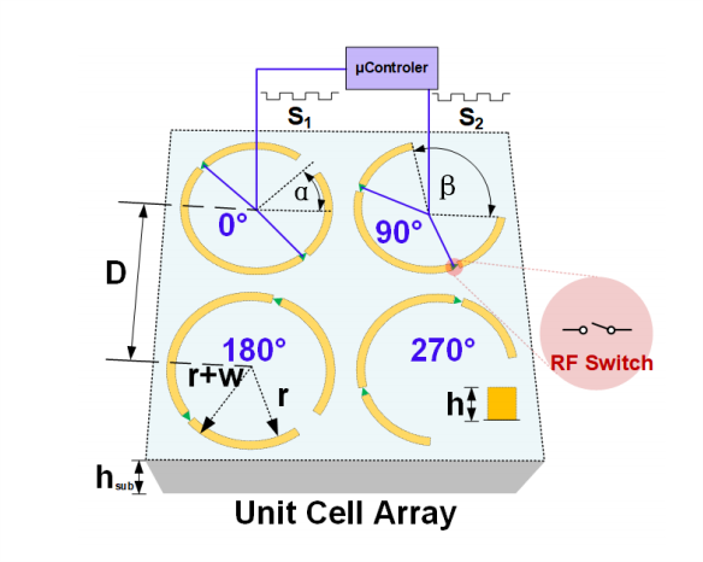
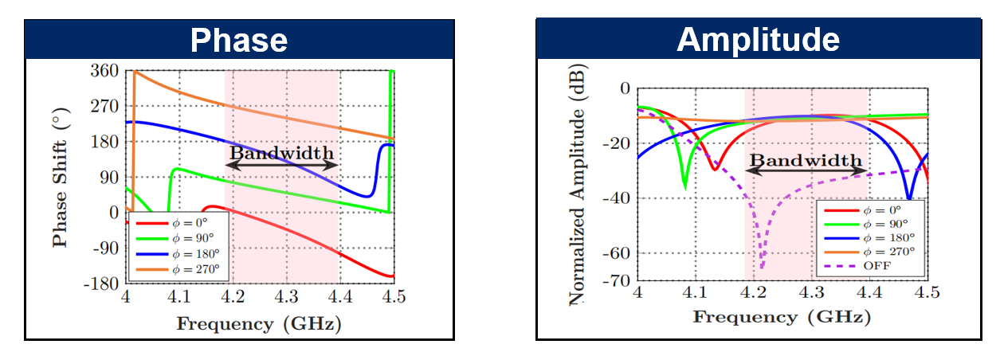
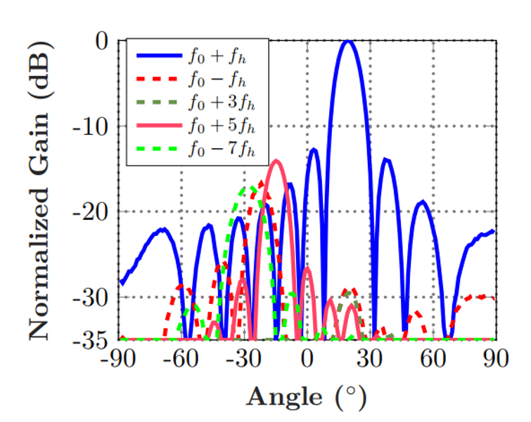

# Spatial-temporal Programmable Metasurface for Single Channel Radiation

2021 APMC

\[[Paper](https://ieeexplore.ieee.org/abstract/document/9661847)\]

Exploiting the spatial-temporal relationship, a novel programmable metasurface architecture is proposed to suppress undesired harmonics for spectrally efficient communication. A single-bit metasurface array with four-element unit cells is proposed to allow dynamic beamforming of the information metasurface without the use of phase shifters. The proposed method achieves an array factor with a harmonic suppression ratio of more than 15 dB. The meta-element design operates at a center frequency of 4.3 GHz with a bandwidth of 200 MHz, which can be exploited further to suppress higher-order harmonics. Using a carrier frequency of 4.2 GHz with a 100 MHz modulation signal, the proposed metasurface transmitting a signal with 50 MHz bandwidth can achieve an adjacent channel power ratio of -14.38 dB, indicating the feasibility of spatial-temporal programmable metasurface in practical communication applications.

